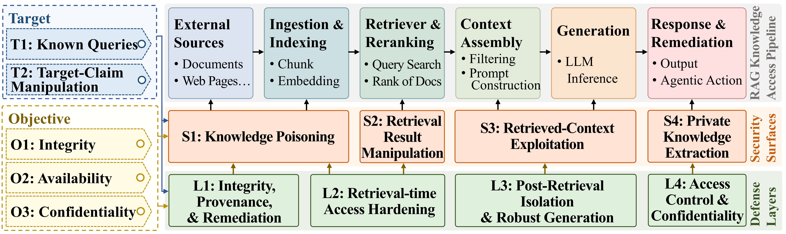

# Awesome-RAG-Security

### News

**Initial release:** This repository records papers on RAG security following the SLOT taxonomy from our survey.

## [Securing Retrieval-Augmented Generation: A Taxonomy of Attacks, Defenses, and Future Directions](https://arxiv.org/pdf/2604.08304)

> *[Yuming Xu](https://thebestfm.github.io/) <sup>1</sup>, Mingtao Zhang <sup>1</sup>, Zhuohan Ge <sup>1</sup>, [Haoyang Li](https://refrainlhy.github.io/) <sup>1</sup>, Nicole Hu <sup>1</sup>, [Yongqi Zhang](https://yzhangee.github.io/) <sup>2</sup>, [Zhiyuan Wen](https://preke.github.io/) <sup>1</sup>, [Jason Chen Zhang](https://www.zhangchen.info/) <sup>1</sup>, [Qing Li](https://www4.comp.polyu.edu.hk/~csqli/) <sup>1</sup>, [Lei Chen](https://home.cse.ust.hk/~leichen/) <sup>2</sup>*

> *<sup>1</sup>The Hong Kong Polytechnic University, <sup>2</sup>The Hong Kong University of Science and Technology (Guangzhou).*

```bibtex
@article{xu2026securing,
  title={Securing Retrieval-Augmented Generation: A Taxonomy of Attacks, Defenses, and Future Directions},
  author={Xu, Yuming and Zhang, Mingtao and Ge, Zhuohan and Li, Haoyang and Hu, Nicole and Zhang, Jason Chen and Li, Qing and Chen, Lei},
  journal={arXiv preprint arXiv:2604.08304},
  year={2026}
}
```

**If you would like to include your paper, suggest improvements to our survey, or discuss related topics with us, please feel free to contact: martin.xu@connect.polyu.hk.**

<p align="center">
  
</p>

<p align="center"><sub>SLOT view of the RAG knowledge-access pipeline. Attack surfaces (S1-S4) and defense layers (L1-L4) are aligned with the pipeline stages, while Objective (O) and Target (T) are cross-cutting tags used to compare attacks, defenses, and benchmarks, i.e., SLOT Tag = Surface/Layer + Objective + Target.</sub></p>

## Taxonomy and Papers

- [Awesome-RAG-Security](#awesome-rag-security)
- [Attack Mechanisms](#attack-mechanisms)
  - [Knowledge Poisoning (S1)](#knowledge-poisoning-s1)
  - [Retrieval Result Manipulation (S2)](#retrieval-result-manipulation-s2)
  - [Retrieved-Context Exploitation (S3)](#retrieved-context-exploitation-s3)
  - [Private Knowledge Extraction (S4)](#private-knowledge-extraction-s4)
- [Defenses and Remediation Mechanisms](#defenses-and-remediation-mechanisms)
  - [Knowledge-Base Integrity and Remediation (L1)](#knowledge-base-integrity-and-remediation-l1)
  - [Retrieval-Time Access Hardening (L2)](#retrieval-time-access-hardening-l2)
  - [Post-Retrieval Context Isolation (L3)](#post-retrieval-context-isolation-l3)
  - [Access Control, Privacy and Confidentiality (L4)](#access-control-privacy-and-confidentiality-l4)
- [Secure-RAG Evaluation Studies](#secure-rag-evaluation-studies)
  - [Benchmark Studies](#benchmark-studies)
  - [Systematic Evaluation Studies](#systematic-evaluation-studies)

---

# Attack Mechanisms

## Knowledge Poisoning (S1)

### Text Corpus / Memory Poisoning ([To Top](#awesome-rag-security))

| Year | Title | **S**urface/**L**ayer | **O**bjective | **T**arget | Venue | Official Link |
| ---- | ----- | --------------------- | ------------- | ---------- | ----- | ------------- |
| 2026 | MIRAGE: Misleading Retrieval-Augmented Generation via Black-box and Query-agnostic Poisoning Attacks | S1 | O1 | T2 | arXiv | [Paper](https://arxiv.org/pdf/2512.08289) |
| 2026 | Memory Injection Attacks on LLM Agents via Query-Only Interaction | S1 | O1 | T1 | NeurIPS | [Paper](https://openreview.net/pdf?id=QINnsnppv8) [Code](https://github.com/dsh3n77/MINJA) |
| 2025 | PoisonedRAG: Knowledge Corruption Attacks to Retrieval-Augmented Generation of Large Language Models | S1 | O1 | T1 | USENIX Security | [Paper](https://www.usenix.org/system/files/usenixsecurity25-zou-poisonedrag.pdf) [Code](https://github.com/sleeepeer/PoisonedRAG) |
| 2025 | GASLITEing the Retrieval: Exploring Vulnerabilities in Dense Embedding-based Search | S1 | O1 | T1 | ACM CCS | [Paper](https://dl.acm.org/doi/pdf/10.1145/3719027.3765095) [Code](https://github.com/matanbt/gaslite) |
| 2025 | Practical Poisoning Attacks against Retrieval-Augmented Generation | S1 | O1 | T1 | arXiv | [Paper](https://arxiv.org/pdf/2504.03957) |
| 2025 | One Shot Dominance: Knowledge Poisoning Attack on Retrieval-Augmented Generation Systems | S1 | O1 | T1 | Findings of EMNLP | [Paper](https://aclanthology.org/2025.findings-emnlp.1023.pdf) [Code](https://github.com/microsoft/CoR) |
| 2025 | UniC-RAG: Universal Knowledge Corruption Attacks to Retrieval-Augmented Generation | S1 | O1 | T2 | arXiv | [Paper](https://arxiv.org/pdf/2508.18652) |
| 2025 | MemoryGraft: Persistent Compromise of LLM Agents via Poisoned Experience Retrieval | S1 | O1 | T1 | arXiv | [Paper](https://arxiv.org/pdf/2512.16962) [Code](https://github.com/Jacobhhy/Agent-Memory-Poisoning) |
| 2024 | BadRAG: Identifying Vulnerabilities in Retrieval Augmented Generation of Large Language Models | S1 | O1, O2 (partial) | T1 | arXiv | [Paper](https://arxiv.org/pdf/2406.00083) |
| 2024 | Typos that Broke the RAG's Back: Genetic Attack on RAG Pipeline by Simulating Documents in the Wild via Low-level Perturbations | S1 | O1 | T1 | Findings of EMNLP | [Paper](https://aclanthology.org/2024.findings-emnlp.161.pdf) [Code](https://aclanthology.org/2024.findings-emnlp.161.software.zip) |
| 2024 | Human-Imperceptible Retrieval Poisoning Attacks in LLM-Powered Applications | S1 | O1 | T1 | FSE Companion | [Paper](https://dl.acm.org/doi/pdf/10.1145/3663529.3663786) |
| 2024 | HijackRAG: Hijacking Attacks against Retrieval-Augmented Large Language Models | S1 | O1 | T1 | arXiv | [Paper](https://arxiv.org/pdf/2410.22832) [Code](https://github.com/BarryZYC/HijackRAG) |
| 2024 | AgentPoison: Red-teaming LLM Agents via Poisoning Memory or Knowledge Bases | S1 | O1 | T1 | NeurIPS | [Paper](https://proceedings.neurips.cc/paper_files/paper/2024/file/eb113910e9c3f6242541c1652e30dfd6-Paper-Conference.pdf) [Code](https://github.com/AI-secure/AgentPoison) |

### Data-Loading Poisoning ([To Top](#awesome-rag-security))

| Year | Title | **S**urface/**L**ayer | **O**bjective | **T**arget | Venue | Official Link |
| ---- | ----- | --------------------- | ------------- | ---------- | ----- | ------------- |
| 2025 | The Hidden Threat in Plain Text: Attacking RAG Data Loaders | S1 | O1 | T1 | ACM AISec | [Paper](https://dl.acm.org/doi/pdf/10.1145/3733799.3762976) [Code](https://github.com/pajola/PhantomText) |

### Graph / Multimodal Knowledge Poisoning ([To Top](#awesome-rag-security))

| Year | Title | **S**urface/**L**ayer | **O**bjective | **T**arget | Venue | Official Link |
| ---- | ----- | --------------------- | ------------- | ---------- | ----- | ------------- |
| 2026 | One Pic is All it Takes: Poisoning Visual Document Retrieval Augmented Generation with a Single Image | S1 | O1, O2 (partial) | T1 | TMLR | [Paper](https://openreview.net/pdf?id=CLkjUidlYg) [Code](https://github.com/alan-turing-institute/mumoRAG-attacks) |
| 2025 | GraphRAG under Fire | S1 | O1 | T2 | arXiv | [Paper](https://arxiv.org/pdf/2501.14050) [Code](https://github.com/JACKPURCELL/GraphRAG_Under_Fire) |
| 2025 | A Few Words Can Distort Graphs: Knowledge Poisoning Attacks on Graph-based Retrieval-Augmented Generation of Large Language Models | S1 | O1 | T1 | arXiv | [Paper](https://arxiv.org/pdf/2508.04276) |
| 2025 | MM-PoisonRAG: Disrupting Multimodal RAG with Local and Global Poisoning Attacks | S1 | O1 | T1 | arXiv | [Paper](https://arxiv.org/pdf/2502.17832) [Code](https://github.com/HyeonjeongHa/MM-PoisonRAG) |
| 2025 | Poisoned-MRAG: Knowledge Poisoning Attacks to Multimodal Retrieval Augmented Generation | S1 | O1 | T1 | arXiv | [Paper](https://arxiv.org/pdf/2503.06254) |
| 2026 | Medusa: Cross-Modal Transferable Adversarial Attacks on Multimodal Medical Retrieval-Augmented Generation | S1 | O1 | T1 | KDD | [Paper](https://dl.acm.org/doi/pdf/10.1145/3770854.3780277) [Code](https://anonymous.4open.science/r/MMed-RAG-Attack-F05A) |

### Code-Oriented Knowledge Poisoning ([To Top](#awesome-rag-security))

| Year | Title | **S**urface/**L**ayer | **O**bjective | **T**arget | Venue | Official Link |
| ---- | ----- | --------------------- | ------------- | ---------- | ----- | ------------- |
| 2025 | Exploring the Security Threats of Knowledge Base Poisoning in Retrieval-Augmented Code Generation | S1 | O1 | T1 | arXiv | [Paper](https://arxiv.org/pdf/2502.03233) |
| 2025 | ImportSnare: Directed Code Manual Hijacking in Retrieval-Augmented Code Generation | S1 | O1 | T1 | ACM CCS | [Paper](https://dl.acm.org/doi/pdf/10.1145/3719027.3765161) [Code](https://github.com/jiuqu3513/ImportSnare) |
| 2025 | RAG-Pull: Imperceptible Attacks on RAG Systems for Code Generation | S1 | O1 | T1 | arXiv | [Paper](https://arxiv.org/pdf/2510.11195) |

## Retrieval Result Manipulation (S2)

### Query-Side Redirection ([To Top](#awesome-rag-security))

| Year | Title | **S**urface/**L**ayer | **O**bjective | **T**arget | Venue | Official Link |
| ---- | ----- | --------------------- | ------------- | ---------- | ----- | ------------- |
| 2024 | Prompt Perturbation in Retrieval-Augmented Generation based Large Language Models | S2 | O1 | T1 | KDD | [Paper](https://dl.acm.org/doi/pdf/10.1145/3637528.3671932) [Code](https://github.com/Hadise-zb/Prompt-Perturbation-in-Retrieval-Augmented-Generation) |

### Document Ranking / Retriever Compromise ([To Top](#awesome-rag-security))

| Year | Title | **S**urface/**L**ayer | **O**bjective | **T**arget | Venue | Official Link |
| ---- | ----- | --------------------- | ------------- | ---------- | ----- | ------------- |
| 2025 | The Silent Saboteur: Imperceptible Adversarial Attacks against Black-Box Retrieval-Augmented Generation Systems | S2 | O1 | T1 | Findings of ACL | [Paper](https://aclanthology.org/2025.findings-acl.717.pdf) [Code](https://github.com/ruyisy/ReGENT) |
| 2025 | FlippedRAG: Black-Box Opinion Manipulation Adversarial Attacks to Retrieval-Augmented Generation Models | S2 | O1 | T2 | ACM CCS | [Paper](https://dl.acm.org/doi/pdf/10.1145/3719027.3765023) |
| 2025 | Topic-FlipRAG: Topic-Orientated Adversarial Opinion Manipulation Attacks to Retrieval-Augmented Generation Models | S2 | O1 | T2 | USENIX Security | [Paper](https://www.usenix.org/system/files/usenixsecurity25-gong-yuyang.pdf) [Code](https://github.com/LauJames/Topic-FlipRAG) |
| 2025 | PR-Attack: Coordinated Prompt-RAG Attacks on Retrieval-Augmented Generation in Large Language Models via Bilevel Optimization | S2 | O1 | T1 | SIGIR | [Paper](https://dl.acm.org/doi/pdf/10.1145/3726302.3730058) |
| 2024 | Backdoored Retrievers for Prompt Injection Attacks on Retrieval Augmented Generation of Large Language Models | S2 | O1 | T1 | arXiv | [Paper](https://arxiv.org/pdf/2410.14479) |

## Retrieved-Context Exploitation (S3)

### Indirect Prompt Injection / Jailbreak / Backdoor ([To Top](#awesome-rag-security))

| Year | Title | **S**urface/**L**ayer | **O**bjective | **T**arget | Venue | Official Link |
| ---- | ----- | --------------------- | ------------- | ---------- | ----- | ------------- |
| 2026 | PIDP-Attack: Combining Prompt Injection with Database Poisoning Attacks on Retrieval-Augmented Generation Systems | S3 | O1 | T1 | arXiv | [Paper](https://arxiv.org/pdf/2603.25164) [Code](https://anonymous.4open.science/r/PIDP-03BC) |
| 2025 | Benchmarking and Defending Against Indirect Prompt Injection Attacks on Large Language Models | S3 | O1 | T1 | KDD | [Paper](https://dl.acm.org/doi/pdf/10.1145/3690624.3709179) [Code](https://github.com/microsoft/BIPIA) |
| 2024 | PANDORA: Jailbreak GPTs by Retrieval Augmented Generation Poisoning | S3 | O1 | T1 | AISCC | [Paper](https://tianweiz07.github.io/Papers/24-aiscc.pdf) |
| 2024 | Phantom: General Trigger Attacks on Retrieval Augmented Language Generation | S3 | O1, O3 (partial) | T1 | arXiv | [Paper](https://arxiv.org/pdf/2405.20485) |
| 2024 | TrojanRAG: Retrieval-Augmented Generation Can Be Backdoor Driver in Large Language Models | S3 | O1 | T1 | arXiv | [Paper](https://arxiv.org/pdf/2405.13401) [Code](https://github.com/Charles-ydd/TrojanRAG) |
| 2024 | ConfusedPilot: Confused Deputy Risks in RAG-based LLMs | S3 | O1, O3 (partial) | T1 | arXiv | [Paper](https://arxiv.org/pdf/2408.04870) |
| 2023 | Not What You've Signed Up For: Compromising Real-World LLM-Integrated Applications with Indirect Prompt Injection | S3 | O1 | T1 | ACM AISec | [Paper](https://dl.acm.org/doi/pdf/10.1145/3605764.3623985) |

### Availability / Denial / Refusal Abuse ([To Top](#awesome-rag-security))

| Year | Title | **S**urface/**L**ayer | **O**bjective | **T**arget | Venue | Official Link |
| ---- | ----- | --------------------- | ------------- | ---------- | ----- | ------------- |
| 2025 | Machine Against the RAG: Jamming Retrieval-Augmented Generation with Blocker Documents | S3 | O2 | T1 | USENIX Security | [Paper](https://www.usenix.org/system/files/usenixsecurity25-shafran.pdf) [Code](https://github.com/avitalsh/jamming_attack) |
| 2025 | Hoist with His Own Petard: Inducing Guardrails to Facilitate Denial-of-Service Attacks on Retrieval-Augmented Generation of LLMs | S3 | O2 | T1 | arXiv | [Paper](https://arxiv.org/pdf/2504.21680) |

## Private Knowledge Extraction (S4)

### Membership Inference ([To Top](#awesome-rag-security))

| Year | Title | **S**urface/**L**ayer | **O**bjective | **T**arget | Venue | Official Link |
| ---- | ----- | --------------------- | ------------- | ---------- | ----- | ------------- |
| 2025 | Is My Data in Your Retrieval Database? Membership Inference Attacks Against Retrieval Augmented Generation | S4 | O3 | T1 | ICISSP | [Paper](https://www.scitepress.org/Papers/2025/131083/131083.pdf) |
| 2025 | Generating Is Believing: Membership Inference Attacks against Retrieval-Augmented Generation | S4 | O3 | T1 | ICASSP | [Paper](https://ieeexplore.ieee.org/stamp/stamp.jsp?arnumber=10889013) |
| 2025 | Mask-based Membership Inference Attacks for Retrieval-Augmented Generation | S4 | O3 | T1 | WWW | [Paper](https://dl.acm.org/doi/pdf/10.1145/3696410.3714771) |
| 2025 | Riddle Me This! Stealthy Membership Inference for Retrieval-Augmented Generation | S4 | O3 | T1 | ACM CCS | [Paper](https://dl.acm.org/doi/pdf/10.1145/3719027.3744840) [Code](https://github.com/ali7naseh/RAG_MIA) |

### Targeted Data Extraction ([To Top](#awesome-rag-security))

| Year | Title | **S**urface/**L**ayer | **O**bjective | **T**arget | Venue | Official Link |
| ---- | ----- | --------------------- | ------------- | ---------- | ----- | ------------- |
| 2025 | Follow My Instruction and Spill the Beans: Scalable Data Extraction from Retrieval-Augmented Generation Systems | S4 | O3 | T1 | ICLR | [Paper](https://openreview.net/pdf?id=Y4aWwRh25b) [Code](https://github.com/zhentingqi/rag-privacy) |
| 2025 | Silent Leaks: Implicit Knowledge Extraction Attack on RAG Systems through Benign Queries | S4 | O3 | T1 | ICML Workshop | [Paper](https://openreview.net/pdf?id=F5TD0OExsf) [Code](https://github.com/Wangyuhao06/IKEA) |
| 2025 | External Data Extraction Attacks against Retrieval-Augmented Large Language Models | S4 | O3 | T1 | arXiv | [Paper](https://arxiv.org/pdf/2510.02964) |
| 2024 | Data Extraction Attacks in Retrieval-Augmented Generation via Backdoors | S4 | O3 | T1 | arXiv | [Paper](https://arxiv.org/pdf/2411.01705) |

### Corpus-Scale / Multi-Turn Extraction / Pivoting ([To Top](#awesome-rag-security))

| Year | Title | **S**urface/**L**ayer | **O**bjective | **T**arget | Venue | Official Link |
| ---- | ----- | --------------------- | ------------- | ---------- | ----- | ------------- |
| 2026 | Connect the Dots: Knowledge Graph-Guided Crawler Attack on Retrieval-Augmented Generation Systems | S4 | O3 | T2 | arXiv | [Paper](https://arxiv.org/pdf/2601.15678) |
| 2026 | Retrieval Pivot Attacks in Hybrid RAG: Measuring and Mitigating Amplified Leakage from Vector Seeds to Graph Expansion | S4 | O3 | T2 | arXiv | [Paper](https://arxiv.org/pdf/2602.08668) [Code](https://github.com/scthornton/hybrid-rag-pivot-attacks) |

---

# Defenses and Remediation Mechanisms

## Knowledge-Base Integrity and Remediation (L1)

### Provenance and Admission ([To Top](#awesome-rag-security))

| Year | Title | **S**urface/**L**ayer | **O**bjective | **T**arget | Venue | Official Link |
| ---- | ----- | --------------------- | ------------- | ---------- | ----- | ------------- |
| 2025 | D-RAG: A Privacy-Preserving Framework for Decentralized RAG using Blockchain | L1 | O1 | T1 | CS and IT Conference Proceedings | [Paper](https://aircconline.com/csit/papers/vol15/csit150417.pdf) |
| 2025 | Proof-Carrying Answers: A Systematic Protocol for Verifiable Retrieval-Augmented Generation with Cryptographic Provenance | L1 | O1 | T1 | ACSAC Workshops | [Paper](https://www.computer.org/csdl/proceedings-article/acsac-workshops/2025/453600a405/2eOZTkNoHSM) [Code](https://github.com/HimJoe/proof-carrying-answers) |

### Ingestion-Time Validation ([To Top](#awesome-rag-security))

| Year | Title | **S**urface/**L**ayer | **O**bjective | **T**arget | Venue | Official Link |
| ---- | ----- | --------------------- | ------------- | ---------- | ----- | ------------- |
| 2026 | RAGShield: Detecting Numerical Claim Manipulation in Government RAG Systems | L1 | O1 | T1 | arXiv | [Paper](https://arxiv.org/pdf/2604.00387) |

### Forensics and Remediation ([To Top](#awesome-rag-security))

| Year | Title | **S**urface/**L**ayer | **O**bjective | **T**arget | Venue | Official Link |
| ---- | ----- | --------------------- | ------------- | ---------- | ----- | ------------- |
| 2026 | Who Taught the Lie? Responsibility Attribution for Poisoned Knowledge in Retrieval-Augmented Generation | L1 | O1 | T1 | IEEE S&P | [Paper](https://www.computer.org/csdl/proceedings-article/sp/2026/606500a977/2bojvOwadcQ) [Code](https://github.com/zhangbl6618/RAG-Responsibility-Attribution) |
| 2025 | Traceback of Poisoning Attacks to Retrieval-Augmented Generation | L1 | O1 | T1 | WWW | [Paper](https://dl.acm.org/doi/pdf/10.1145/3696410.3714756) [Code](https://github.com/zhangbl6618/RAG-Responsibility-Attribution) |

## Retrieval-Time Access Hardening (L2)

### Reliability-Aware Aggregation ([To Top](#awesome-rag-security))

| Year | Title | **S**urface/**L**ayer | **O**bjective | **T**arget | Venue | Official Link |
| ---- | ----- | --------------------- | ------------- | ---------- | ----- | ------------- |
| 2026 | Adversarial Intent is a Latent Variable: Stateful Trust Inference for Securing Multimodal Agentic RAG | L2 | O1 | T1 | arXiv | [Paper](https://arxiv.org/pdf/2602.21447) |
| 2025 | ReliabilityRAG: Effective and Provably Robust Defense for RAG-based Web-Search | L2 | O1 | T1 | NeurIPS | [Paper](https://openreview.net/pdf?id=D9JeNTs5Bu) [Code](https://github.com/zeyushen-yo/ReliabilityRAG) |
| 2025 | Retrieval-Augmented Generation with Estimation of Source Reliability | L2 | O1 | T1 | EMNLP | [Paper](https://aclanthology.org/2025.emnlp-main.1738.pdf) [Code](https://github.com/ml-postech/RA-RAG) |
| 2024 | Certifiably Robust RAG against Retrieval Corruption | L2 | O1 | T1 | arXiv | [Paper](https://arxiv.org/pdf/2405.15556) [Code](https://github.com/inspire-group/RobustRAG) |

### Retrieval and Reranking Defense ([To Top](#awesome-rag-security))

| Year | Title | **S**urface/**L**ayer | **O**bjective | **T**arget | Venue | Official Link |
| ---- | ----- | --------------------- | ------------- | ---------- | ----- | ------------- |
| 2025 | TrustRAG: Enhancing Robustness and Trustworthiness in Retrieval-Augmented Generation | L2 | O1, O2 (partial) | T1 | AAAI TrustAgent Workshop | [Paper](https://openreview.net/pdf?id=fw5KQVO7o2) [Code](https://github.com/HuichiZhou/TrustRAG) |
| 2025 | GRADA: Graph-based Reranking against Adversarial Documents Attack | L2 | O1, O2 (partial) | T1 | EMNLP | [Paper](https://aclanthology.org/2025.emnlp-main.1132.pdf) [Code](https://anonymous.4open.science/r/GRADA-266D) |
| 2025 | RAGPart and RAGMask: Retrieval-Stage Defenses Against Corpus Poisoning in Retrieval-Augmented Generation | L2 | O1, O2 (partial) | T1 | arXiv | [Paper](https://arxiv.org/pdf/2512.24268) |
| 2025 | Secure Retrieval-Augmented Generation against Poisoning Attacks | L2 | O1, O2 (partial) | T1 | arXiv | [Paper](https://arxiv.org/pdf/2510.25025) |
| 2025 | Defending against Knowledge Poisoning Attacks during Retrieval-Augmented Generation | L2 | O1, O2 (partial) | T1 | arXiv | [Paper](https://arxiv.org/pdf/2508.02835) |

### Hybrid Filtering and Generation ([To Top](#awesome-rag-security))

| Year | Title | **S**urface/**L**ayer | **O**bjective | **T**arget | Venue | Official Link |
| ---- | ----- | --------------------- | ------------- | ---------- | ----- | ------------- |
| 2025 | SeCon-RAG: A Two-Stage Semantic Filtering and Conflict-Free Framework for Trustworthy RAG | L2 | O1, O2 (partial) | T1 | NeurIPS | [Paper](https://openreview.net/pdf?id=tTwZhy8JqY) [Code](https://github.com/lanmei666/Secon-Rag) |

## Post-Retrieval Context Isolation (L3)

### Poison Detection and Filtering ([To Top](#awesome-rag-security))

| Year | Title | **S**urface/**L**ayer | **O**bjective | **T**arget | Venue | Official Link |
| ---- | ----- | --------------------- | ------------- | ---------- | ----- | ------------- |
| 2026 | Through the Stealth Lens: Attention-Aware Defenses Against Poisoning in RAG | L3 | O1, O2 (partial) | T1 | ICLR | [Paper](https://openreview.net/pdf?id=PS43wqCSME) |
| 2025 | RevPRAG: Revealing Poisoning Attacks in Retrieval-Augmented Generation through LLM Activation Analysis | L3 | O1, O2 (partial) | T1 | Findings of EMNLP | [Paper](https://aclanthology.org/2025.findings-emnlp.698.pdf) |
| 2025 | Rescuing the Unpoisoned: Efficient Defense against Knowledge Corruption Attacks on RAG Systems | L3 | O1, O2 (partial) | T1 | ACSAC | [Paper](https://doi.org/10.1109/ACSAC67867.2025.00093) [Code](https://github.com/SecAI-Lab/RAGDefender) |

### Attention and Interaction Control ([To Top](#awesome-rag-security))

| Year | Title | **S**urface/**L**ayer | **O**bjective | **T**arget | Venue | Official Link |
| ---- | ----- | --------------------- | ------------- | ---------- | ----- | ------------- |
| 2026 | Addressing Corpus Knowledge Poisoning Attacks on RAG Using Sparse Attention | L3 | O1 | T1 | arXiv | [Paper](https://arxiv.org/pdf/2602.04711) [Code](https://github.com/sagie-dekel/Sparse-Document-Attention-RAG) |

### Robust Generation Baselines ([To Top](#awesome-rag-security))

| Year | Title | **S**urface/**L**ayer | **O**bjective | **T**arget | Venue | Official Link |
| ---- | ----- | --------------------- | ------------- | ---------- | ----- | ------------- |
| 2025 | InstructRAG: Instructing Retrieval-Augmented Generation via Self-Synthesized Rationales | L3 | O1 | T1 | ICLR | [Paper](https://openreview.net/pdf?id=P1qhkp8gQT) [Code](https://github.com/weizhepei/InstructRAG) |
| 2025 | Astute RAG: Overcoming Imperfect Retrieval Augmentation and Knowledge Conflicts for Large Language Models | L3 | O1 | T1 | ACL | [Paper](https://aclanthology.org/2025.acl-long.1476.pdf) |
| 2025 | RbFT: Robust Fine-tuning for Retrieval-Augmented Generation against Retrieval Defects | L3 | O1 | T1 | SIGIR | [Paper](https://dl.acm.org/doi/pdf/10.1145/3726302.3730078) [Code](https://github.com/StibiumT16/Robust-Fine-tuning) |
| 2024 | Why So Gullible? Enhancing the Robustness of Retrieval-Augmented Models against Counterfactual Noise | L3 | O1 | T1 | Findings of NAACL | [Paper](https://aclanthology.org/2024.findings-naacl.159.pdf) [Code](https://github.com/wjdghks950/Discern-and-Answer) |

## Access Control, Privacy and Confidentiality (L4)

### Authorization and Access Control ([To Top](#awesome-rag-security))

| Year | Title | **S**urface/**L**ayer | **O**bjective | **T**arget | Venue | Official Link |
| ---- | ----- | --------------------- | ------------- | ---------- | ----- | ------------- |
| 2026 | SD-RAG: A Prompt-Injection-Resilient Framework for Selective Disclosure in Retrieval-Augmented Generation | L4 | O3 | T1 | arXiv | [Paper](https://arxiv.org/pdf/2601.11199) |
| 2025 | Integrating Access Control with Retrieval-Augmented Generation: A Proof of Concept for Managing Sensitive Patient Profiles | L4 | O3 | T1 | ACM SAC | [Paper](https://dl.acm.org/doi/pdf/10.1145/3672608.3707848) |

### Local DP and Decoding Shields ([To Top](#awesome-rag-security))

| Year | Title | **S**urface/**L**ayer | **O**bjective | **T**arget | Venue | Official Link |
| ---- | ----- | --------------------- | ------------- | ---------- | ----- | ------------- |
| 2025 | RAG with Differential Privacy | L4 | O3 | T1 | IEEE CAI | [Paper](https://ieeexplore.ieee.org/stamp/stamp.jsp?arnumber=11050672) |
| 2025 | Mitigating Privacy Risks in Retrieval-Augmented Generation via Locally Private Entity Perturbation | L4 | O3 | T1 | Information Processing and Management | [Paper](https://www.sciencedirect.com/science/article/pii/S0306457325000913/pdfft?isDTMRedir=true&download=true) |
| 2025 | VAGUE-Gate: Plug-and-Play Local-Privacy Shield for Retrieval-Augmented Generation | L4 | O3 | T1 | IJCNLP-AACL | [Paper](https://aclanthology.org/2025.ijcnlp-long.194.pdf) [Code](https://github.com/arshiahemmat/LDP_RAG) |
| 2025 | Privacy-Aware Decoding: Mitigating Privacy Leakage of Large Language Models in Retrieval-Augmented Generation | L4 | O3 | T1 | arXiv | [Paper](https://arxiv.org/pdf/2508.03098) [Code](https://github.com/wang2226/PAD) |
| 2025 | InvisibleInk: High-Utility and Low-Cost Text Generation with Differential Privacy | L4 | O3 | T1 | NeurIPS | [Paper](https://openreview.net/pdf?id=B4NT8TexNS) [Code](https://github.com/cerai-iitm/InvisibleInk-Experiments) |
| 2024 | Privacy-Preserving Retrieval-Augmented Generation with Differential Privacy | L4 | O3 | T1 | arXiv | [Paper](https://arxiv.org/pdf/2412.04697) [Code](https://github.com/tacchan7412/DPRAG) |

### Corpus Transformation ([To Top](#awesome-rag-security))

| Year | Title | **S**urface/**L**ayer | **O**bjective | **T**arget | Venue | Official Link |
| ---- | ----- | --------------------- | ------------- | ---------- | ----- | ------------- |
| 2025 | Mitigating the Privacy Issues in Retrieval-Augmented Generation via Pure Synthetic Data | L4 | O3 | T1 | EMNLP | [Paper](https://aclanthology.org/2025.emnlp-main.1247.pdf) [Code](https://github.com/phycholosogy/RAG-SAGE) |

### Secure Retrieval Backends ([To Top](#awesome-rag-security))

| Year | Title | **S**urface/**L**ayer | **O**bjective | **T**arget | Venue | Official Link |
| ---- | ----- | --------------------- | ------------- | ---------- | ----- | ------------- |
| 2025 | RemoteRAG: A Privacy-Preserving LLM Cloud RAG Service | L4 | O3 | T1 | Findings of ACL | [Paper](https://aclanthology.org/2025.findings-acl.197.pdf) |
| 2025 | Efficient Privacy-Preserving Retrieval Augmented Generation with Distance-Preserving Encryption | L4 | O3 | T1 | FLLM | [Paper](https://ieeexplore.ieee.org/stamp/stamp.jsp?arnumber=11391120) |
| 2024 | FRAG: Toward Federated Vector Database Management for Collaborative and Secure Retrieval-Augmented Generation | L4 | O3 | T1 | arXiv | [Paper](https://arxiv.org/pdf/2410.13272) |

### Confidential Architectures ([To Top](#awesome-rag-security))

| Year | Title | **S**urface/**L**ayer | **O**bjective | **T**arget | Venue | Official Link |
| ---- | ----- | --------------------- | ------------- | ---------- | ----- | ------------- |
| 2025 | Privacy-Preserving Federated Embedding Learning for Localized Retrieval-Augmented Generation | L4 | O3 | T1 | arXiv | [Paper](https://arxiv.org/pdf/2504.19101) |
| 2025 | Privacy-Aware RAG: Secure and Isolated Knowledge Retrieval | L4 | O3 | T1 | arXiv | [Paper](https://arxiv.org/pdf/2503.15548) |
| 2025 | Provably Secure Retrieval-Augmented Generation | L4 | O3 | T1 | arXiv | [Paper](https://arxiv.org/pdf/2508.01084) |
| 2025 | SecureRAG: End-to-End Secure Retrieval-Augmented Generation | L4 | O3 | T1 | GenAI for Health Workshop | [Paper](https://openreview.net/pdf?id=njAyzNEaCd) |
| 2024 | C-FedRAG: A Confidential Federated Retrieval-Augmented Generation System | L4 | O3 | T1 | arXiv | [Paper](https://arxiv.org/pdf/2412.13163) |

---

# Secure-RAG Evaluation Studies

## Benchmark Studies ([To Top](#awesome-rag-security))

| Year | Title | **S**urface/**L**ayer | **O**bjective | **T**arget | Venue | Official Link |
| ---- | ----- | --------------------- | ------------- | ---------- | ----- | ------------- |
| 2026 | Hidden-in-Plain-Text: A Benchmark for Social-Web Indirect Prompt Injection in RAG | S1, S2 (partial), S3 | O1 | T1 | WWW | [Paper](https://dl.acm.org/doi/pdf/10.1145/3774904.3792853) |
| 2026 | MPIB: A Benchmark for Medical Prompt Injection Attacks and Clinical Safety in LLMs | S3 | O1 | T1 | arXiv | [Paper](https://arxiv.org/pdf/2602.06268) [Code](https://github.com/jhlee0619/mpib-eval) |
| 2026 | Privacy Protection in RAG: A Novel Method and Evaluation Framework | -- | O3 | T1 | Information Processing and Management | [Paper](https://www.sciencedirect.com/science/article/pii/S0306457325004467/pdfft?isDTMRedir=true&download=true) |
| 2026 | Benchmarking Knowledge-Extraction Attack and Defense on Retrieval-Augmented Generation | S2 (partial), S4 | O3 | T1 | arXiv | [Paper](https://arxiv.org/pdf/2602.09319) [Code](https://github.com/charlieqi02/RAG-Knowledge-Extraction-Attack-and-Defense-Benchmark) |
| 2026 | MedPriv-Bench: Benchmarking the Privacy-Utility Trade-off of Large Language Models in Medical Open-End Question Answering | S3 (partial), S4 | O3 | T1 | arXiv | [Paper](https://arxiv.org/pdf/2603.14265) |
| 2026 | SEAL-Tag: Self-Tag Evidence Aggregation with Probabilistic Circuits for PII-Safe Retrieval-Augmented Generation | S1 | O3 | T1 | arXiv | [Paper](https://arxiv.org/pdf/2603.17292) |
| 2026 | Worse than Zero-shot? A Fact-Checking Dataset for Evaluating the Robustness of RAG Against Misleading Retrievals | S1 | O1 | T1 | NeurIPS Datasets and Benchmarks | [Paper](https://proceedings.neurips.cc/paper_files/paper/2025/file/ed25c00ff6900989116d3ba5d607d33d-Paper-Datasets_and_Benchmarks_Track.pdf) [Code](https://huggingface.co/datasets/UCSC-IRKM/RAGuard) |
| 2025 | SafeRAG: Benchmarking Security in Retrieval-Augmented Generation of Large Language Model | S1, S2, S3, S4 | O1, O2 (partial) | T1 | ACL | [Paper](https://aclanthology.org/2025.acl-long.230.pdf) [Code](https://github.com/IAAR-Shanghai/SafeRAG) |
| 2025 | Benchmarking Poisoning Attacks against Retrieval-Augmented Generation | S1, S3 (partial) | O1, O2 (partial) | T1 | arXiv | [Paper](https://arxiv.org/pdf/2505.18543) |
| 2025 | PoisonArena: Uncovering Competing Poisoning Attacks in Retrieval-Augmented Generation | S1 | O1 | T1 | arXiv | [Paper](https://arxiv.org/pdf/2505.12574) [Code](https://github.com/yxf203/PoisonArena) |
| 2025 | S-RAG: A Novel Audit Framework for Detecting Unauthorized Use of Personal Data in RAG Systems | S1 | O3 | T1 | ACL | [Paper](https://aclanthology.org/2025.acl-long.512.pdf) [Code](https://github.com/zzrhh/S-RAG) |
| 2025 | SMA: Who Said That? Auditing Membership Leakage in Semi-Black-box RAG Controlling | S1, S2 (partial) | O3 | T1 | arXiv | [Paper](https://arxiv.org/pdf/2508.09105) |
| 2024 | Rag and Roll: An End-to-End Evaluation of Indirect Prompt Manipulations in LLM-based Application Frameworks | S3, S4 (partial) | O1 | T1 | arXiv | [Paper](https://arxiv.org/pdf/2408.05025) |
| 2024 | LLM-PIEval: A Benchmark for Indirect Prompt Injection Attacks in Large Language Models | S3 | O1 | T1 | Amazon Science | [Paper](https://assets.amazon.science/96/7b/19ccfdaa46c3b03807615594f21d/llm-pieval-a-benchmark-for-indirect-prompt-injection-attacks-in-large-language-models.pdf) [Code](https://github.com/amazon-science/llm-pieval) |

## Systematic Evaluation Studies ([To Top](#awesome-rag-security))

| Year | Title | **S**urface/**L**ayer | **O**bjective | **T**arget | Venue | Official Link |
| ---- | ----- | --------------------- | ------------- | ---------- | ----- | ------------- |
| 2026 | A Systemic Evaluation of Multimodal RAG Privacy | S1 | O3 | T1 | arXiv | [Paper](https://arxiv.org/pdf/2601.17644) [Code](https://github.com/aliwister/mrag-attack-eval) |
| 2025 | Beyond Text: Unveiling Privacy Vulnerabilities in Multi-modal Retrieval-Augmented Generation | S1, S2 (partial) | O3 | T1 | EMNLP | [Paper](https://aclanthology.org/2025.emnlp-main.1259.pdf) [Code](https://github.com/phycholosogy/MRAG-privacy) |
| 2024 | The Good and The Bad: Exploring Privacy Issues in Retrieval-Augmented Generation | S1, S4 (partial) | O3 | T1 | Findings of ACL | [Paper](https://aclanthology.org/2024.findings-acl.267.pdf) [Code](https://github.com/phycholosogy/RAG-privacy) |

---

# Citation and Contact

If you find this repository or our survey useful, please consider citing our paper:

```bibtex
@article{xu2026securing,
  title={Securing Retrieval-Augmented Generation: A Taxonomy of Attacks, Defenses, and Future Directions},
  author={Xu, Yuming and Zhang, Mingtao and Ge, Zhuohan and Li, Haoyang and Hu, Nicole and Zhang, Yongqi and Wen, Zhiyuan and Zhang, Jason Chen and Li, Qing and Chen, Lei},
  journal={arXiv preprint arXiv:2604.08304},
  year={2026}
}
```

For paper inclusion, corrections, or suggestions, please feel free to contact:

Yuming Xu: martin.xu@connect.polyu.hk
