# Awesome-RAG-Security

### News

**Initial release:** This repository records papers on RAG security following the SLOT taxonomy from our survey.

## Securing Retrieval-Augmented Generation: A Taxonomy of Attacks, Defenses, and Future Directions

> *Yuming Xu <sup>1</sup>, Mingtao Zhang <sup>1</sup>, Zhuohan Ge <sup>1</sup>, Haoyang Li <sup>1</sup>, Nicole Hu <sup>1</sup>, Yongqi Zhang <sup>2</sup>, Zhiyuan Wen <sup>1</sup>, Jason Chen Zhang <sup>1</sup>, Qing Li <sup>1</sup>, Lei Chen <sup>2</sup>*

> *<sup>1</sup>The Hong Kong Polytechnic University, <sup>2</sup>The Hong Kong University of Science and Technology (Guangzhou).*

- This repository is dedicated to recording papers on attacks, defenses, remediation mechanisms, and evaluation for retrieval-augmented generation (RAG) security. The taxonomy follows the SLOT view: attack Surface, defense Layer, Objective, and Target.
- If you find this survey or repository helpful, please consider citing it.

```bibtex
@article{xu2026securingrag,
  title={Securing Retrieval-Augmented Generation: A Taxonomy of Attacks, Defenses, and Future Directions},
  author={Xu, Yuming and Zhang, Mingtao and Ge, Zhuohan and Li, Haoyang and Hu, Nicole and Zhang, Yongqi and Wen, Zhiyuan and Zhang, Jason Chen and Li, Qing and Chen, Lei},
  journal={arXiv preprint},
  year={2026}
}
```

- If you would like to include your paper or suggest any modification, please open an issue with the paper title, category, and a short summary.

## Taxonomy and Papers

- [Awesome-RAG-Security](#awesome-rag-security)
- [Interactive Taxonomy](#interactive-taxonomy)
  - [RAG Attack Methods](#rag-attack-methods)
  - [RAG Defense and Remediation Mechanisms](#rag-defense-and-remediation-mechanisms)
- [Attack Mechanisms](#attack-mechanisms)
  - [Knowledge Poisoning (S1)](#knowledge-poisoning-s1)
  - [Retrieval Result Manipulation (S2)](#retrieval-result-manipulation-s2)
  - [Retrieved-Context Exploitation (S3)](#retrieved-context-exploitation-s3)
  - [Private Knowledge Extraction (S4)](#private-knowledge-extraction-s4)
- [Defenses and Remediation Mechanisms](#defenses-and-remediation-mechanisms)
  - [Knowledge-Base Integrity and Remediation (L1)](#knowledge-base-integrity-and-remediation-l1)
  - [Retrieval-Time Access Hardening (L2)](#retrieval-time-access-hardening-l2)
  - [Post-Retrieval Context Isolation (L3)](#post-retrieval-context-isolation-l3)
  - [Access Control, Privacy and Confidentiality (L4)](#access-control-privacy-and-confidentiality-l4)
- [Secure-RAG Evaluation Studies](#secure-rag-evaluation-studies)

---

# Interactive Taxonomy

The diagrams mirror the paper taxonomy. Leaf boxes are split by paper so each paper node can be clicked directly in Mermaid-capable Markdown renderers. If your viewer disables Mermaid links, the tables below provide the same clickable PDF links.

## RAG Attack Methods

```mermaid
flowchart LR
  AttackRoot["RAG Attack<br/>Methods"]:::root
  S1["Knowledge<br/>Poisoning (S1)"]:::attack
  S2["Retrieval Result<br/>Manipulation (S2)"]:::attack
  S3["Retrieved-Context<br/>Exploitation (S3)"]:::attack
  S4["Private Knowledge<br/>Extraction (S4)"]:::attack

  AttackRoot --> S1
  AttackRoot --> S2
  AttackRoot --> S3
  AttackRoot --> S4

  S1 --> S1Text["Text Corpus / Memory<br/>Poisoning"]:::attack
  S1 --> S1Load["Data-Loading<br/>Poisoning"]:::attack
  S1 --> S1Graph["Graph / Multimodal<br/>Knowledge Poisoning"]:::attack
  S1 --> S1Code["Code-Oriented<br/>Knowledge Poisoning"]:::attack

  S1Text --> A_PoisonedRAG["PoisonedRAG<br/>O1"]:::paper
  S1Text --> A_BadRAG["BadRAG<br/>O1, O2"]:::paper
  S1Text --> A_GARAG["GARAG<br/>O1"]:::paper
  S1Text --> A_RetrievalPoisoning["Retrieval Poisoning<br/>O1"]:::paper
  S1Text --> A_GASLITE["GASLITE<br/>O1"]:::paper
  S1Text --> A_CorruptRAG["CorruptRAG<br/>O1"]:::paper
  S1Text --> A_AuthChain["AuthChain<br/>O1"]:::paper
  S1Text --> A_UniCRAG["UniC-RAG<br/>O1, T2"]:::paper
  S1Text --> A_MIRAGE["MIRAGE<br/>O1, T2"]:::paper
  S1Text --> A_HijackRAG["HijackRAG<br/>O1"]:::paper
  S1Text --> A_AgentPoison["AgentPoison<br/>O1"]:::paper
  S1Text --> A_MemoryGraft["MemoryGraft<br/>O1"]:::paper
  S1Text --> A_MINJA["MINJA<br/>O1"]:::paper
  S1Load --> A_DataLoaders["RAG Data Loaders<br/>O1"]:::paper
  S1Graph --> A_GRAGPoison["GRAGPoison<br/>O1, T2"]:::paper
  S1Graph --> A_TKPAUKPA["TKPA and UKPA<br/>O1"]:::paper
  S1Graph --> A_MMPoisonRAG["MM-PoisonRAG<br/>O1"]:::paper
  S1Graph --> A_PoisonedMRAG["Poisoned-MRAG<br/>O1"]:::paper
  S1Graph --> A_OnePic["One Pic<br/>O1, O2"]:::paper
  S1Graph --> A_Medusa["Medusa<br/>O1"]:::paper
  S1Code --> A_RACG["RACG<br/>O1"]:::paper
  S1Code --> A_ImportSnare["ImportSnare<br/>O1"]:::paper
  S1Code --> A_RAGPull["RAG-Pull<br/>O1"]:::paper

  S2 --> S2Query["Query-Side<br/>Redirection"]:::attack
  S2 --> S2Rank["Document Ranking /<br/>Retriever Compromise"]:::attack
  S2Query --> A_GGPP["GGPP<br/>O1"]:::paper
  S2Rank --> A_ReGENT["ReGENT<br/>O1"]:::paper
  S2Rank --> A_FlippedRAG["FlippedRAG<br/>O1, T2"]:::paper
  S2Rank --> A_TopicFlipRAG["Topic-FlipRAG<br/>O1, T2"]:::paper
  S2Rank --> A_BackdooredRetrievers["Backdoored Retrievers<br/>O1"]:::paper
  S2Rank --> A_PRAttack["PR-Attack<br/>O1"]:::paper

  S3 --> S3Inject["Indirect Prompt Injection /<br/>Jailbreak / Backdoor"]:::attack
  S3 --> S3Avail["Availability / Denial /<br/>Refusal Abuse"]:::attack
  S3Inject --> A_IndirectInjection["Indirect Injection<br/>O1"]:::paper
  S3Inject --> A_BIPIA["BIPIA<br/>O1"]:::paper
  S3Inject --> A_PANDORA["PANDORA<br/>O1"]:::paper
  S3Inject --> A_Phantom["Phantom<br/>O1, O3"]:::paper
  S3Inject --> A_TrojanRAG["TrojanRAG<br/>O1"]:::paper
  S3Inject --> A_ConfusedPilot["ConfusedPilot<br/>O1, O3"]:::paper
  S3Inject --> A_PIDP["PIDP-Attack<br/>O1"]:::paper
  S3Avail --> A_Blocker["Blocker<br/>O2"]:::paper
  S3Avail --> A_MutedRAG["MutedRAG<br/>O2"]:::paper

  S4 --> S4MIA["Membership<br/>Inference"]:::attack
  S4 --> S4Target["Targeted Data<br/>Extraction"]:::attack
  S4 --> S4Scale["Corpus-Scale / Multi-Turn<br/>Extraction / Pivoting"]:::attack
  S4MIA --> A_MIARAG["MIA-RAG<br/>O3"]:::paper
  S4MIA --> A_S2MIA["S2MIA<br/>O3"]:::paper
  S4MIA --> A_MBA["MBA<br/>O3"]:::paper
  S4MIA --> A_IA["IA<br/>O3"]:::paper
  S4Target --> A_Spill["Spill the Beans<br/>O3"]:::paper
  S4Target --> A_BackdoorExtraction["Backdoor Extraction<br/>O3"]:::paper
  S4Target --> A_IKEA["IKEA<br/>O3"]:::paper
  S4Target --> A_SECRET["SECRET<br/>O3"]:::paper
  S4Scale --> A_RAGCRAWLER["RAGCRAWLER<br/>O3, T2"]:::paper
  S4Scale --> A_RetrievalPivot["Retrieval Pivot<br/>O3, T2"]:::paper

  click A_PoisonedRAG "https://www.usenix.org/system/files/usenixsecurity25-zou-poisonedrag.pdf" "PoisonedRAG PDF"
  click A_BadRAG "https://arxiv.org/pdf/2406.00083" "BadRAG PDF"
  click A_GARAG "https://aclanthology.org/2024.findings-emnlp.161.pdf" "GARAG PDF"
  click A_RetrievalPoisoning "https://arxiv.org/pdf/2404.17196" "Retrieval Poisoning PDF"
  click A_GASLITE "https://arxiv.org/pdf/2412.20953" "GASLITE PDF"
  click A_CorruptRAG "https://arxiv.org/pdf/2504.03957" "CorruptRAG PDF"
  click A_AuthChain "https://aclanthology.org/2025.findings-emnlp.1023.pdf" "AuthChain PDF"
  click A_UniCRAG "https://arxiv.org/pdf/2508.18652" "UniC-RAG PDF"
  click A_MIRAGE "https://arxiv.org/pdf/2512.08289" "MIRAGE PDF"
  click A_HijackRAG "https://arxiv.org/pdf/2410.22832" "HijackRAG PDF"
  click A_AgentPoison "https://arxiv.org/pdf/2407.12784" "AgentPoison PDF"
  click A_MemoryGraft "https://arxiv.org/pdf/2512.16962" "MemoryGraft PDF"
  click A_MINJA "https://arxiv.org/pdf/2503.03704" "MINJA PDF"
  click A_DataLoaders "https://arxiv.org/pdf/2507.05093" "RAG Data Loaders PDF"
  click A_GRAGPoison "https://arxiv.org/pdf/2501.14050" "GRAGPoison PDF"
  click A_TKPAUKPA "https://arxiv.org/pdf/2508.04276" "TKPA and UKPA PDF"
  click A_MMPoisonRAG "https://arxiv.org/pdf/2502.17832" "MM-PoisonRAG PDF"
  click A_PoisonedMRAG "https://arxiv.org/pdf/2503.06254" "Poisoned-MRAG PDF"
  click A_OnePic "https://openreview.net/pdf?id=CLkjUidlYg" "One Pic PDF"
  click A_Medusa "https://arxiv.org/pdf/2511.19257" "Medusa PDF"
  click A_RACG "https://arxiv.org/pdf/2502.03233" "RACG PDF"
  click A_ImportSnare "https://arxiv.org/pdf/2509.07941" "ImportSnare PDF"
  click A_RAGPull "https://arxiv.org/pdf/2510.11195" "RAG-Pull PDF"
  click A_GGPP "https://arxiv.org/pdf/2402.07179" "GGPP PDF"
  click A_ReGENT "https://aclanthology.org/2025.findings-acl.717.pdf" "ReGENT PDF"
  click A_FlippedRAG "https://dl.acm.org/doi/pdf/10.1145/3719027.3765023" "FlippedRAG PDF"
  click A_TopicFlipRAG "https://www.usenix.org/system/files/usenixsecurity25-gong-yuyang.pdf" "Topic-FlipRAG PDF"
  click A_BackdooredRetrievers "https://arxiv.org/pdf/2410.14479" "Backdoored Retrievers PDF"
  click A_PRAttack "https://arxiv.org/pdf/2504.07717" "PR-Attack PDF"
  click A_IndirectInjection "https://arxiv.org/pdf/2302.12173" "Indirect Injection PDF"
  click A_BIPIA "https://arxiv.org/pdf/2312.14197" "BIPIA PDF"
  click A_PANDORA "https://arxiv.org/pdf/2402.08416" "PANDORA PDF"
  click A_Phantom "https://arxiv.org/pdf/2405.20485" "Phantom PDF"
  click A_TrojanRAG "https://arxiv.org/pdf/2405.13401" "TrojanRAG PDF"
  click A_ConfusedPilot "https://arxiv.org/pdf/2408.04870" "ConfusedPilot PDF"
  click A_PIDP "https://arxiv.org/pdf/2603.25164" "PIDP-Attack PDF"
  click A_Blocker "https://www.usenix.org/system/files/usenixsecurity25-shafran.pdf" "Blocker PDF"
  click A_MutedRAG "https://arxiv.org/pdf/2504.21680" "MutedRAG PDF"
  click A_MIARAG "https://arxiv.org/pdf/2405.20446" "MIA-RAG PDF"
  click A_S2MIA "https://arxiv.org/pdf/2406.19234" "S2MIA PDF"
  click A_MBA "https://arxiv.org/pdf/2410.20142" "MBA PDF"
  click A_IA "https://arxiv.org/pdf/2502.00306" "IA PDF"
  click A_Spill "https://openreview.net/pdf?id=Y4aWwRh25b" "Spill the Beans PDF"
  click A_BackdoorExtraction "https://arxiv.org/pdf/2411.01705" "Backdoor Extraction PDF"
  click A_IKEA "https://openreview.net/pdf?id=F5TD0OExsf" "IKEA PDF"
  click A_SECRET "https://arxiv.org/pdf/2510.02964" "SECRET PDF"
  click A_RAGCRAWLER "https://arxiv.org/pdf/2601.15678" "RAGCRAWLER PDF"
  click A_RetrievalPivot "https://arxiv.org/pdf/2602.08668" "Retrieval Pivot PDF"

  classDef root fill:#ffffff,stroke:#333333,color:#111111;
  classDef attack fill:#D5E8D4,stroke:#333333,color:#111111;
  classDef paper fill:#ffffff,stroke:#333333,color:#111111;
```



## RAG Defense and Remediation Mechanisms

```mermaid
flowchart LR
  DefenseRoot["RAG Defense and<br/>Remediation Mechanisms"]:::root
  L1["Knowledge-Base<br/>Integrity and<br/>Remediation (L1)"]:::defense
  L2["Retrieval-Time<br/>Access Hardening (L2)"]:::defense
  L3["Post-Retrieval<br/>Context Isolation (L3)"]:::defense
  L4["Access Control,<br/>Privacy and<br/>Confidentiality (L4)"]:::defense

  DefenseRoot --> L1
  DefenseRoot --> L2
  DefenseRoot --> L3
  DefenseRoot --> L4

  L1 --> L1Prov["Provenance and<br/>Admission"]:::defense
  L1 --> L1Valid["Ingestion-Time<br/>Validation"]:::defense
  L1 --> L1Forensics["Forensics and<br/>Remediation"]:::defense
  L1Prov --> D_DRAG["D-RAG<br/>O1"]:::paper
  L1Prov --> D_PCA["Proof-Carrying Answers<br/>O1"]:::paper
  L1Valid --> D_RAGShield["RAGShield<br/>O1"]:::paper
  L1Forensics --> D_RAGForensics["RAGForensics<br/>O1"]:::paper
  L1Forensics --> D_WhoTaught["Who Taught the Lie?<br/>O1"]:::paper

  L2 --> L2Agg["Reliability-Aware<br/>Aggregation"]:::defense
  L2 --> L2Rerank["Retrieval and Reranking<br/>Defense"]:::defense
  L2 --> L2Hybrid["Hybrid Filtering and<br/>Generation"]:::defense
  L2Agg --> D_RobustRAG["RobustRAG<br/>O1"]:::paper
  L2Agg --> D_ReliabilityRAG["ReliabilityRAG<br/>O1"]:::paper
  L2Agg --> D_RARAG["RA-RAG<br/>O1"]:::paper
  L2Agg --> D_MMARAGT["MMA-RAGT<br/>O1"]:::paper
  L2Rerank --> D_TrustRAG["TrustRAG<br/>O1, O2"]:::paper
  L2Rerank --> D_GRADA["GRADA<br/>O1, O2"]:::paper
  L2Rerank --> D_RAGPartMask["RAGPart/RAGMask<br/>O1, O2"]:::paper
  L2Rerank --> D_RAGuard["RAGuard<br/>O1, O2"]:::paper
  L2Rerank --> D_FilterRAG["FilterRAG<br/>O1, O2"]:::paper
  L2Hybrid --> D_SeCon["SeCon-RAG<br/>O1, O2"]:::paper

  L3 --> L3Poison["Poison Detection and<br/>Filtering"]:::defense
  L3 --> L3Attention["Attention and<br/>Interaction Control"]:::defense
  L3 --> L3Generation["Robust Generation<br/>Baselines"]:::defense
  L3Poison --> D_RevPRAG["RevPRAG<br/>O1, O2"]:::paper
  L3Poison --> D_AVFilter["AV Filter<br/>O1, O2"]:::paper
  L3Poison --> D_RAGDefender["RAGDefender<br/>O1, O2"]:::paper
  L3Attention --> D_SDAG["SDAG<br/>O1"]:::paper
  L3Generation --> D_Discern["Discern-and-Answer<br/>O1"]:::paper
  L3Generation --> D_InstructRAG["InstructRAG<br/>O1"]:::paper
  L3Generation --> D_AstuteRAG["Astute RAG<br/>O1"]:::paper
  L3Generation --> D_RbFT["RbFT<br/>O1"]:::paper

  L4 --> L4Auth["Authorization and<br/>Access Control"]:::defense
  L4 --> L4DP["Local DP and<br/>Decoding Shields"]:::defense
  L4 --> L4Corpus["Corpus<br/>Transformation"]:::defense
  L4 --> L4Backend["Secure Retrieval<br/>Backends"]:::defense
  L4 --> L4Arch["Confidential<br/>Architectures"]:::defense
  L4Auth --> D_SDRAG["SD-RAG<br/>O3"]:::paper
  L4Auth --> D_ACRAG["AC-RAG<br/>O3"]:::paper
  L4DP --> D_DPVoteRAG["DPVoteRAG<br/>O3"]:::paper
  L4DP --> D_RAGDP["RAG with DP<br/>O3"]:::paper
  L4DP --> D_LPRAG["LPRAG<br/>O3"]:::paper
  L4DP --> D_VAGUE["VAGUE-Gate<br/>O3"]:::paper
  L4DP --> D_PAD["PAD<br/>O3"]:::paper
  L4DP --> D_InvisibleInk["InvisibleInk<br/>O3"]:::paper
  L4Corpus --> D_SAGE["SAGE<br/>O3"]:::paper
  L4Backend --> D_RemoteRAG["RemoteRAG<br/>O3"]:::paper
  L4Backend --> D_ppRAG["ppRAG<br/>O3"]:::paper
  L4Backend --> D_FRAG["FRAG<br/>O3"]:::paper
  L4Arch --> D_FedE4RAG["FedE4RAG<br/>O3"]:::paper
  L4Arch --> D_CFedRAG["C-FedRAG<br/>O3"]:::paper
  L4Arch --> D_PrivacyAwareRAG["Privacy-Aware RAG<br/>O3"]:::paper
  L4Arch --> D_SAG["SAG<br/>O3"]:::paper
  L4Arch --> D_SecureRAG["SecureRAG<br/>O3"]:::paper

  click D_DRAG "https://par.nsf.gov/servlets/purl/10578004" "D-RAG PDF"
  click D_PCA "https://raw.githubusercontent.com/HimJoe/proof-carrying-answers/main/PAC%20for%20RAG%20CyrptographyWAITI%20Shukla%20Joshi.pdf" "Proof-Carrying Answers PDF"
  click D_RAGShield "https://arxiv.org/pdf/2604.00387" "RAGShield PDF"
  click D_RAGForensics "https://arxiv.org/pdf/2504.21668" "RAGForensics PDF"
  click D_WhoTaught "https://arxiv.org/pdf/2509.13772" "Who Taught the Lie? PDF"
  click D_RobustRAG "https://arxiv.org/pdf/2405.15556" "RobustRAG PDF"
  click D_ReliabilityRAG "https://openreview.net/pdf?id=D9JeNTs5Bu" "ReliabilityRAG PDF"
  click D_RARAG "https://aclanthology.org/2025.emnlp-main.1738.pdf" "RA-RAG PDF"
  click D_MMARAGT "https://arxiv.org/pdf/2602.21447" "MMA-RAGT PDF"
  click D_TrustRAG "https://arxiv.org/pdf/2501.00879" "TrustRAG PDF"
  click D_GRADA "https://aclanthology.org/2025.emnlp-main.1132.pdf" "GRADA PDF"
  click D_RAGPartMask "https://arxiv.org/pdf/2512.24268" "RAGPart/RAGMask PDF"
  click D_RAGuard "https://arxiv.org/pdf/2510.25025" "RAGuard PDF"
  click D_FilterRAG "https://arxiv.org/pdf/2508.02835" "FilterRAG PDF"
  click D_SeCon "https://arxiv.org/pdf/2510.09710" "SeCon-RAG PDF"
  click D_RevPRAG "https://aclanthology.org/2025.findings-emnlp.698.pdf" "RevPRAG PDF"
  click D_AVFilter "https://openreview.net/pdf?id=PS43wqCSME" "AV Filter PDF"
  click D_RAGDefender "https://arxiv.org/pdf/2511.01268" "RAGDefender PDF"
  click D_SDAG "https://arxiv.org/pdf/2602.04711" "SDAG PDF"
  click D_Discern "https://arxiv.org/pdf/2305.01579" "Discern-and-Answer PDF"
  click D_InstructRAG "https://openreview.net/pdf?id=P1qhkp8gQT" "InstructRAG PDF"
  click D_AstuteRAG "https://aclanthology.org/2025.acl-long.1476.pdf" "Astute RAG PDF"
  click D_RbFT "https://arxiv.org/pdf/2501.18365" "RbFT PDF"
  click D_SDRAG "https://arxiv.org/pdf/2601.11199" "SD-RAG PDF"
  click D_ACRAG "https://dl.acm.org/doi/pdf/10.1145/3672608.3707848" "AC-RAG PDF"
  click D_DPVoteRAG "https://arxiv.org/pdf/2412.04697" "DPVoteRAG PDF"
  click D_RAGDP "https://arxiv.org/pdf/2412.19291" "RAG with Differential Privacy PDF"
  click D_LPRAG "https://www.sciencedirect.com/science/article/pii/S0306457325000913/pdfft?isDTMRedir=true&download=true" "LPRAG PDF"
  click D_VAGUE "https://aclanthology.org/2025.ijcnlp-long.194.pdf" "VAGUE-Gate PDF"
  click D_PAD "https://arxiv.org/pdf/2508.03098" "PAD PDF"
  click D_InvisibleInk "https://arxiv.org/pdf/2507.02974" "InvisibleInk PDF"
  click D_SAGE "https://aclanthology.org/2025.emnlp-main.1247.pdf" "SAGE PDF"
  click D_RemoteRAG "https://aclanthology.org/2025.findings-acl.197.pdf" "RemoteRAG PDF"
  click D_ppRAG "https://arxiv.org/pdf/2601.12331" "ppRAG PDF"
  click D_FRAG "https://arxiv.org/pdf/2410.13272" "FRAG PDF"
  click D_FedE4RAG "https://arxiv.org/pdf/2504.19101" "FedE4RAG PDF"
  click D_CFedRAG "https://arxiv.org/pdf/2412.13163" "C-FedRAG PDF"
  click D_PrivacyAwareRAG "https://arxiv.org/pdf/2503.15548" "Privacy-Aware RAG PDF"
  click D_SAG "https://arxiv.org/pdf/2508.01084" "SAG PDF"
  click D_SecureRAG "https://openreview.net/pdf?id=njAyzNEaCd" "SecureRAG PDF"

  classDef root fill:#ffffff,stroke:#333333,color:#111111;
  classDef defense fill:#D6E0F0,stroke:#333333,color:#111111;
  classDef paper fill:#ffffff,stroke:#333333,color:#111111;
```



---

# Attack Mechanisms

## Knowledge Poisoning (S1)

### Text Corpus / Memory Poisoning ([To Top](#awesome-rag-security))

| Year | Title | Type | Venue | Paper | Code |
| ---- | ----- | ---- | ----- | ----- | ---- |
| 2025 | [PoisonedRAG: Knowledge Corruption Attacks to Retrieval-Augmented Generation of Large Language Models](https://www.usenix.org/system/files/usenixsecurity25-zou-poisonedrag.pdf) | Text Corpus / Memory Poisoning | USENIX Security | [Link](https://www.usenix.org/system/files/usenixsecurity25-zou-poisonedrag.pdf) |  |
| 2024 | [BadRAG: Identifying Vulnerabilities in Retrieval Augmented Generation of Large Language Models](https://arxiv.org/pdf/2406.00083) | Text Corpus / Memory Poisoning | arXiv | [Link](https://arxiv.org/pdf/2406.00083) |  |
| 2024 | [Typos that Broke the RAG's Back: Genetic Attack on RAG Pipeline by Simulating Documents in the Wild via Low-level Perturbations](https://aclanthology.org/2024.findings-emnlp.161.pdf) | Text Corpus / Memory Poisoning | Findings of EMNLP | [Link](https://aclanthology.org/2024.findings-emnlp.161.pdf) |  |
| 2024 | [Human-Imperceptible Retrieval Poisoning Attacks in LLM-Powered Applications](https://arxiv.org/pdf/2404.17196) | Text Corpus / Memory Poisoning | FSE Companion | [Link](https://arxiv.org/pdf/2404.17196) |  |
| 2025 | [GASLITEing the Retrieval: Exploring Vulnerabilities in Dense Embedding-based Search](https://arxiv.org/pdf/2412.20953) | Text Corpus / Memory Poisoning | ACM CCS | [Link](https://arxiv.org/pdf/2412.20953) |  |
| 2025 | [Practical Poisoning Attacks against Retrieval-Augmented Generation](https://arxiv.org/pdf/2504.03957) | Text Corpus / Memory Poisoning | arXiv | [Link](https://arxiv.org/pdf/2504.03957) |  |
| 2025 | [One Shot Dominance: Knowledge Poisoning Attack on Retrieval-Augmented Generation Systems](https://aclanthology.org/2025.findings-emnlp.1023.pdf) | Text Corpus / Memory Poisoning | Findings of EMNLP | [Link](https://aclanthology.org/2025.findings-emnlp.1023.pdf) |  |
| 2025 | [UniC-RAG: Universal Knowledge Corruption Attacks to Retrieval-Augmented Generation](https://arxiv.org/pdf/2508.18652) | Text Corpus / Memory Poisoning | arXiv | [Link](https://arxiv.org/pdf/2508.18652) |  |
| 2026 | [MIRAGE: Misleading Retrieval-Augmented Generation via Black-box and Query-agnostic Poisoning Attacks](https://arxiv.org/pdf/2512.08289) | Text Corpus / Memory Poisoning | arXiv | [Link](https://arxiv.org/pdf/2512.08289) |  |
| 2024 | [HijackRAG: Hijacking Attacks against Retrieval-Augmented Large Language Models](https://arxiv.org/pdf/2410.22832) | Text Corpus / Memory Poisoning | arXiv | [Link](https://arxiv.org/pdf/2410.22832) |  |
| 2024 | [AgentPoison: Red-teaming LLM Agents via Poisoning Memory or Knowledge Bases](https://arxiv.org/pdf/2407.12784) | Text Corpus / Memory Poisoning | arXiv | [Link](https://arxiv.org/pdf/2407.12784) |  |
| 2025 | [MemoryGraft: Persistent Compromise of LLM Agents via Poisoned Experience Retrieval](https://arxiv.org/pdf/2512.16962) | Text Corpus / Memory Poisoning | arXiv | [Link](https://arxiv.org/pdf/2512.16962) |  |
| 2026 | [Memory Injection Attacks on LLM Agents via Query-Only Interaction](https://arxiv.org/pdf/2503.03704) | Text Corpus / Memory Poisoning | arXiv | [Link](https://arxiv.org/pdf/2503.03704) |  |

### Data-Loading Poisoning ([To Top](#awesome-rag-security))

| Year | Title | Type | Venue | Paper | Code |
| ---- | ----- | ---- | ----- | ----- | ---- |
| 2025 | [The Hidden Threat in Plain Text: Attacking RAG Data Loaders](https://arxiv.org/pdf/2507.05093) | Data-Loading Poisoning | ACM AISec | [Link](https://arxiv.org/pdf/2507.05093) |  |

### Graph / Multimodal Knowledge Poisoning ([To Top](#awesome-rag-security))

| Year | Title | Type | Venue | Paper | Code |
| ---- | ----- | ---- | ----- | ----- | ---- |
| 2025 | [GraphRAG under Fire](https://arxiv.org/pdf/2501.14050) | Graph / Multimodal Knowledge Poisoning | arXiv | [Link](https://arxiv.org/pdf/2501.14050) |  |
| 2025 | [A Few Words Can Distort Graphs: Knowledge Poisoning Attacks on Graph-based Retrieval-Augmented Generation of Large Language Models](https://arxiv.org/pdf/2508.04276) | Graph / Multimodal Knowledge Poisoning | arXiv | [Link](https://arxiv.org/pdf/2508.04276) |  |
| 2025 | [MM-PoisonRAG: Disrupting Multimodal RAG with Local and Global Poisoning Attacks](https://arxiv.org/pdf/2502.17832) | Graph / Multimodal Knowledge Poisoning | arXiv | [Link](https://arxiv.org/pdf/2502.17832) |  |
| 2025 | [Poisoned-MRAG: Knowledge Poisoning Attacks to Multimodal Retrieval Augmented Generation](https://arxiv.org/pdf/2503.06254) | Graph / Multimodal Knowledge Poisoning | arXiv | [Link](https://arxiv.org/pdf/2503.06254) |  |
| 2026 | [One Pic is All it Takes: Poisoning Visual Document Retrieval Augmented Generation with a Single Image](https://openreview.net/pdf?id=CLkjUidlYg) | Graph / Multimodal Knowledge Poisoning | TMLR | [Link](https://openreview.net/pdf?id=CLkjUidlYg) |  |
| 2025 | [Medusa: Cross-Modal Transferable Adversarial Attacks on Multimodal Medical Retrieval-Augmented Generation](https://arxiv.org/pdf/2511.19257) | Graph / Multimodal Knowledge Poisoning | arXiv | [Link](https://arxiv.org/pdf/2511.19257) |  |

### Code-Oriented Knowledge Poisoning ([To Top](#awesome-rag-security))

| Year | Title | Type | Venue | Paper | Code |
| ---- | ----- | ---- | ----- | ----- | ---- |
| 2025 | [Exploring the Security Threats of Knowledge Base Poisoning in Retrieval-Augmented Code Generation](https://arxiv.org/pdf/2502.03233) | Code-Oriented Knowledge Poisoning | arXiv | [Link](https://arxiv.org/pdf/2502.03233) |  |
| 2025 | [ImportSnare: Directed Code Manual Hijacking in Retrieval-Augmented Code Generation](https://arxiv.org/pdf/2509.07941) | Code-Oriented Knowledge Poisoning | ACM CCS | [Link](https://arxiv.org/pdf/2509.07941) |  |
| 2025 | [RAG-Pull: Imperceptible Attacks on RAG Systems for Code Generation](https://arxiv.org/pdf/2510.11195) | Code-Oriented Knowledge Poisoning | arXiv | [Link](https://arxiv.org/pdf/2510.11195) |  |

## Retrieval Result Manipulation (S2)

### Query-Side Redirection ([To Top](#awesome-rag-security))

| Year | Title | Type | Venue | Paper | Code |
| ---- | ----- | ---- | ----- | ----- | ---- |
| 2024 | [Prompt Perturbation in Retrieval-Augmented Generation based Large Language Models](https://arxiv.org/pdf/2402.07179) | Query-Side Redirection | KDD | [Link](https://arxiv.org/pdf/2402.07179) |  |

### Document Ranking / Retriever Compromise ([To Top](#awesome-rag-security))

| Year | Title | Type | Venue | Paper | Code |
| ---- | ----- | ---- | ----- | ----- | ---- |
| 2025 | [The Silent Saboteur: Imperceptible Adversarial Attacks against Black-Box Retrieval-Augmented Generation Systems](https://aclanthology.org/2025.findings-acl.717.pdf) | Document Ranking / Retriever Compromise | Findings of ACL | [Link](https://aclanthology.org/2025.findings-acl.717.pdf) |  |
| 2025 | [FlippedRAG: Black-Box Opinion Manipulation Adversarial Attacks to Retrieval-Augmented Generation Models](https://dl.acm.org/doi/pdf/10.1145/3719027.3765023) | Document Ranking / Retriever Compromise | ACM CCS | [Link](https://dl.acm.org/doi/pdf/10.1145/3719027.3765023) |  |
| 2025 | [Topic-FlipRAG: Topic-Orientated Adversarial Opinion Manipulation Attacks to Retrieval-Augmented Generation Models](https://www.usenix.org/system/files/usenixsecurity25-gong-yuyang.pdf) | Document Ranking / Retriever Compromise | USENIX Security | [Link](https://www.usenix.org/system/files/usenixsecurity25-gong-yuyang.pdf) |  |
| 2024 | [Backdoored Retrievers for Prompt Injection Attacks on Retrieval Augmented Generation of Large Language Models](https://arxiv.org/pdf/2410.14479) | Document Ranking / Retriever Compromise | arXiv | [Link](https://arxiv.org/pdf/2410.14479) |  |
| 2025 | [PR-Attack: Coordinated Prompt-RAG Attacks on Retrieval-Augmented Generation in Large Language Models via Bilevel Optimization](https://arxiv.org/pdf/2504.07717) | Document Ranking / Retriever Compromise | SIGIR | [Link](https://arxiv.org/pdf/2504.07717) |  |

## Retrieved-Context Exploitation (S3)

### Indirect Prompt Injection / Jailbreak / Backdoor ([To Top](#awesome-rag-security))

| Year | Title | Type | Venue | Paper | Code |
| ---- | ----- | ---- | ----- | ----- | ---- |
| 2023 | [Not What You've Signed Up For: Compromising Real-World LLM-Integrated Applications with Indirect Prompt Injection](https://arxiv.org/pdf/2302.12173) | Indirect Prompt Injection / Jailbreak / Backdoor | ACM AISec | [Link](https://arxiv.org/pdf/2302.12173) |  |
| 2025 | [Benchmarking and Defending Against Indirect Prompt Injection Attacks on Large Language Models](https://arxiv.org/pdf/2312.14197) | Indirect Prompt Injection / Jailbreak / Backdoor | WWW | [Link](https://arxiv.org/pdf/2312.14197) |  |
| 2024 | [PANDORA: Jailbreak GPTs by Retrieval Augmented Generation Poisoning](https://arxiv.org/pdf/2402.08416) | Indirect Prompt Injection / Jailbreak / Backdoor | arXiv | [Link](https://arxiv.org/pdf/2402.08416) |  |
| 2024 | [Phantom: General Trigger Attacks on Retrieval Augmented Language Generation](https://arxiv.org/pdf/2405.20485) | Indirect Prompt Injection / Jailbreak / Backdoor | arXiv | [Link](https://arxiv.org/pdf/2405.20485) |  |
| 2024 | [TrojanRAG: Retrieval-Augmented Generation Can Be Backdoor Driver in Large Language Models](https://arxiv.org/pdf/2405.13401) | Indirect Prompt Injection / Jailbreak / Backdoor | arXiv | [Link](https://arxiv.org/pdf/2405.13401) |  |
| 2024 | [ConfusedPilot: Confused Deputy Risks in RAG-based LLMs](https://arxiv.org/pdf/2408.04870) | Indirect Prompt Injection / Jailbreak / Backdoor | arXiv | [Link](https://arxiv.org/pdf/2408.04870) |  |
| 2026 | [PIDP-Attack: Combining Prompt Injection with Database Poisoning Attacks on Retrieval-Augmented Generation Systems](https://arxiv.org/pdf/2603.25164) | Indirect Prompt Injection / Jailbreak / Backdoor | arXiv | [Link](https://arxiv.org/pdf/2603.25164) |  |

### Availability / Denial / Refusal Abuse ([To Top](#awesome-rag-security))

| Year | Title | Type | Venue | Paper | Code |
| ---- | ----- | ---- | ----- | ----- | ---- |
| 2025 | [Machine Against the RAG: Jamming Retrieval-Augmented Generation with Blocker Documents](https://www.usenix.org/system/files/usenixsecurity25-shafran.pdf) | Availability / Denial / Refusal Abuse | USENIX Security | [Link](https://www.usenix.org/system/files/usenixsecurity25-shafran.pdf) |  |
| 2025 | [Hoist with His Own Petard: Inducing Guardrails to Facilitate Denial-of-Service Attacks on Retrieval-Augmented Generation of LLMs](https://arxiv.org/pdf/2504.21680) | Availability / Denial / Refusal Abuse | arXiv | [Link](https://arxiv.org/pdf/2504.21680) |  |

## Private Knowledge Extraction (S4)

### Membership Inference ([To Top](#awesome-rag-security))

| Year | Title | Type | Venue | Paper | Code |
| ---- | ----- | ---- | ----- | ----- | ---- |
| 2025 | [Is My Data in Your Retrieval Database? Membership Inference Attacks Against Retrieval Augmented Generation](https://arxiv.org/pdf/2405.20446) | Membership Inference | ICISSP | [Link](https://arxiv.org/pdf/2405.20446) |  |
| 2025 | [Generating Is Believing: Membership Inference Attacks against Retrieval-Augmented Generation](https://arxiv.org/pdf/2406.19234) | Membership Inference | ICASSP | [Link](https://arxiv.org/pdf/2406.19234) |  |
| 2025 | [Mask-based Membership Inference Attacks for Retrieval-Augmented Generation](https://arxiv.org/pdf/2410.20142) | Membership Inference | WWW | [Link](https://arxiv.org/pdf/2410.20142) |  |
| 2025 | [Riddle Me This! Stealthy Membership Inference for Retrieval-Augmented Generation](https://arxiv.org/pdf/2502.00306) | Membership Inference | ACM CCS | [Link](https://arxiv.org/pdf/2502.00306) |  |

### Targeted Data Extraction ([To Top](#awesome-rag-security))

| Year | Title | Type | Venue | Paper | Code |
| ---- | ----- | ---- | ----- | ----- | ---- |
| 2025 | [Follow My Instruction and Spill the Beans: Scalable Data Extraction from Retrieval-Augmented Generation Systems](https://openreview.net/pdf?id=Y4aWwRh25b) | Targeted Data Extraction | ICLR | [Link](https://openreview.net/pdf?id=Y4aWwRh25b) |  |
| 2024 | [Data Extraction Attacks in Retrieval-Augmented Generation via Backdoors](https://arxiv.org/pdf/2411.01705) | Targeted Data Extraction | arXiv | [Link](https://arxiv.org/pdf/2411.01705) |  |
| 2025 | [Silent Leaks: Implicit Knowledge Extraction Attack on RAG Systems through Benign Queries](https://openreview.net/pdf?id=F5TD0OExsf) | Targeted Data Extraction | ICML Workshop | [Link](https://openreview.net/pdf?id=F5TD0OExsf) |  |
| 2025 | [External Data Extraction Attacks against Retrieval-Augmented Large Language Models](https://arxiv.org/pdf/2510.02964) | Targeted Data Extraction | arXiv | [Link](https://arxiv.org/pdf/2510.02964) |  |

### Corpus-Scale / Multi-Turn Extraction / Pivoting ([To Top](#awesome-rag-security))

| Year | Title | Type | Venue | Paper | Code |
| ---- | ----- | ---- | ----- | ----- | ---- |
| 2026 | [Connect the Dots: Knowledge Graph-Guided Crawler Attack on Retrieval-Augmented Generation Systems](https://arxiv.org/pdf/2601.15678) | Corpus-Scale / Multi-Turn Extraction / Pivoting | arXiv | [Link](https://arxiv.org/pdf/2601.15678) |  |
| 2026 | [Retrieval Pivot Attacks in Hybrid RAG: Measuring and Mitigating Amplified Leakage from Vector Seeds to Graph Expansion](https://arxiv.org/pdf/2602.08668) | Corpus-Scale / Multi-Turn Extraction / Pivoting | arXiv | [Link](https://arxiv.org/pdf/2602.08668) |  |

---

# Defenses and Remediation Mechanisms

## Knowledge-Base Integrity and Remediation (L1)

### Provenance and Admission ([To Top](#awesome-rag-security))

| Year | Title | Type | Venue | Paper | Code |
| ---- | ----- | ---- | ----- | ----- | ---- |
| 2025 | [D-RAG: A Privacy-Preserving Framework for Decentralized RAG using Blockchain](https://par.nsf.gov/servlets/purl/10578004) | Provenance and Admission | CS and IT Conference Proceedings | [Link](https://par.nsf.gov/servlets/purl/10578004) |  |
| 2025 | [Proof-Carrying Answers: A Systematic Protocol for Verifiable Retrieval-Augmented Generation with Cryptographic Provenance](https://raw.githubusercontent.com/HimJoe/proof-carrying-answers/main/PAC%20for%20RAG%20CyrptographyWAITI%20Shukla%20Joshi.pdf) | Provenance and Admission | ACSAC Workshops | [Link](https://raw.githubusercontent.com/HimJoe/proof-carrying-answers/main/PAC%20for%20RAG%20CyrptographyWAITI%20Shukla%20Joshi.pdf) |  |

### Ingestion-Time Validation ([To Top](#awesome-rag-security))

| Year | Title | Type | Venue | Paper | Code |
| ---- | ----- | ---- | ----- | ----- | ---- |
| 2026 | [RAGShield: Detecting Numerical Claim Manipulation in Government RAG Systems](https://arxiv.org/pdf/2604.00387) | Ingestion-Time Validation | arXiv | [Link](https://arxiv.org/pdf/2604.00387) |  |

### Forensics and Remediation ([To Top](#awesome-rag-security))

| Year | Title | Type | Venue | Paper | Code |
| ---- | ----- | ---- | ----- | ----- | ---- |
| 2025 | [Traceback of Poisoning Attacks to Retrieval-Augmented Generation](https://arxiv.org/pdf/2504.21668) | Forensics and Remediation | WWW | [Link](https://arxiv.org/pdf/2504.21668) |  |
| 2026 | [Who Taught the Lie? Responsibility Attribution for Poisoned Knowledge in Retrieval-Augmented Generation](https://arxiv.org/pdf/2509.13772) | Forensics and Remediation | IEEE S&P | [Link](https://arxiv.org/pdf/2509.13772) |  |

## Retrieval-Time Access Hardening (L2)

### Reliability-Aware Aggregation ([To Top](#awesome-rag-security))

| Year | Title | Type | Venue | Paper | Code |
| ---- | ----- | ---- | ----- | ----- | ---- |
| 2024 | [Certifiably Robust RAG against Retrieval Corruption](https://arxiv.org/pdf/2405.15556) | Reliability-Aware Aggregation | arXiv | [Link](https://arxiv.org/pdf/2405.15556) |  |
| 2025 | [ReliabilityRAG: Effective and Provably Robust Defense for RAG-based Web-Search](https://openreview.net/pdf?id=D9JeNTs5Bu) | Reliability-Aware Aggregation | NeurIPS | [Link](https://openreview.net/pdf?id=D9JeNTs5Bu) |  |
| 2025 | [Retrieval-Augmented Generation with Estimation of Source Reliability](https://aclanthology.org/2025.emnlp-main.1738.pdf) | Reliability-Aware Aggregation | EMNLP | [Link](https://aclanthology.org/2025.emnlp-main.1738.pdf) |  |
| 2026 | [Adversarial Intent is a Latent Variable: Stateful Trust Inference for Securing Multimodal Agentic RAG](https://arxiv.org/pdf/2602.21447) | Reliability-Aware Aggregation | arXiv | [Link](https://arxiv.org/pdf/2602.21447) |  |

### Retrieval and Reranking Defense ([To Top](#awesome-rag-security))

| Year | Title | Type | Venue | Paper | Code |
| ---- | ----- | ---- | ----- | ----- | ---- |
| 2025 | [TrustRAG: Enhancing Robustness and Trustworthiness in Retrieval-Augmented Generation](https://arxiv.org/pdf/2501.00879) | Retrieval and Reranking Defense | arXiv | [Link](https://arxiv.org/pdf/2501.00879) |  |
| 2025 | [GRADA: Graph-based Reranking against Adversarial Documents Attack](https://aclanthology.org/2025.emnlp-main.1132.pdf) | Retrieval and Reranking Defense | EMNLP | [Link](https://aclanthology.org/2025.emnlp-main.1132.pdf) |  |
| 2025 | [RAGPart and RAGMask: Retrieval-Stage Defenses Against Corpus Poisoning in Retrieval-Augmented Generation](https://arxiv.org/pdf/2512.24268) | Retrieval and Reranking Defense | arXiv | [Link](https://arxiv.org/pdf/2512.24268) |  |
| 2025 | [Secure Retrieval-Augmented Generation against Poisoning Attacks](https://arxiv.org/pdf/2510.25025) | Retrieval and Reranking Defense | arXiv | [Link](https://arxiv.org/pdf/2510.25025) |  |
| 2025 | [Defending against Knowledge Poisoning Attacks during Retrieval-Augmented Generation](https://arxiv.org/pdf/2508.02835) | Retrieval and Reranking Defense | arXiv | [Link](https://arxiv.org/pdf/2508.02835) |  |

### Hybrid Filtering and Generation ([To Top](#awesome-rag-security))

| Year | Title | Type | Venue | Paper | Code |
| ---- | ----- | ---- | ----- | ----- | ---- |
| 2025 | [SeCon-RAG: A Two-Stage Semantic Filtering and Conflict-Free Framework for Trustworthy RAG](https://arxiv.org/pdf/2510.09710) | Hybrid Filtering and Generation | arXiv | [Link](https://arxiv.org/pdf/2510.09710) |  |

## Post-Retrieval Context Isolation (L3)

### Poison Detection and Filtering ([To Top](#awesome-rag-security))

| Year | Title | Type | Venue | Paper | Code |
| ---- | ----- | ---- | ----- | ----- | ---- |
| 2025 | [RevPRAG: Revealing Poisoning Attacks in Retrieval-Augmented Generation through LLM Activation Analysis](https://aclanthology.org/2025.findings-emnlp.698.pdf) | Poison Detection and Filtering | Findings of EMNLP | [Link](https://aclanthology.org/2025.findings-emnlp.698.pdf) |  |
| 2026 | [Through the Stealth Lens: Attention-Aware Defenses Against Poisoning in RAG](https://openreview.net/pdf?id=PS43wqCSME) | Poison Detection and Filtering | OpenReview | [Link](https://openreview.net/pdf?id=PS43wqCSME) |  |
| 2025 | [Rescuing the Unpoisoned: Efficient Defense against Knowledge Corruption Attacks on RAG Systems](https://arxiv.org/pdf/2511.01268) | Poison Detection and Filtering | arXiv | [Link](https://arxiv.org/pdf/2511.01268) |  |

### Attention and Interaction Control ([To Top](#awesome-rag-security))

| Year | Title | Type | Venue | Paper | Code |
| ---- | ----- | ---- | ----- | ----- | ---- |
| 2026 | [Addressing Corpus Knowledge Poisoning Attacks on RAG Using Sparse Attention](https://arxiv.org/pdf/2602.04711) | Attention and Interaction Control | arXiv | [Link](https://arxiv.org/pdf/2602.04711) |  |

### Robust Generation Baselines ([To Top](#awesome-rag-security))

| Year | Title | Type | Venue | Paper | Code |
| ---- | ----- | ---- | ----- | ----- | ---- |
| 2024 | [Why So Gullible? Enhancing the Robustness of Retrieval-Augmented Models against Counterfactual Noise](https://arxiv.org/pdf/2305.01579) | Robust Generation Baselines | Findings of NAACL | [Link](https://arxiv.org/pdf/2305.01579) |  |
| 2025 | [InstructRAG: Instructing Retrieval-Augmented Generation via Self-Synthesized Rationales](https://openreview.net/pdf?id=P1qhkp8gQT) | Robust Generation Baselines | ICLR | [Link](https://openreview.net/pdf?id=P1qhkp8gQT) |  |
| 2025 | [Astute RAG: Overcoming Imperfect Retrieval Augmentation and Knowledge Conflicts for Large Language Models](https://aclanthology.org/2025.acl-long.1476.pdf) | Robust Generation Baselines | ACL | [Link](https://aclanthology.org/2025.acl-long.1476.pdf) |  |
| 2025 | [RbFT: Robust Fine-tuning for Retrieval-Augmented Generation against Retrieval Defects](https://arxiv.org/pdf/2501.18365) | Robust Generation Baselines | arXiv | [Link](https://arxiv.org/pdf/2501.18365) |  |

## Access Control, Privacy and Confidentiality (L4)

### Authorization and Access Control ([To Top](#awesome-rag-security))

| Year | Title | Type | Venue | Paper | Code |
| ---- | ----- | ---- | ----- | ----- | ---- |
| 2026 | [SD-RAG: A Prompt-Injection-Resilient Framework for Selective Disclosure in Retrieval-Augmented Generation](https://arxiv.org/pdf/2601.11199) | Authorization and Access Control | arXiv | [Link](https://arxiv.org/pdf/2601.11199) |  |
| 2025 | [Integrating Access Control with Retrieval-Augmented Generation: A Proof of Concept for Managing Sensitive Patient Profiles](https://dl.acm.org/doi/pdf/10.1145/3672608.3707848) | Authorization and Access Control | ACM SAC | [Link](https://dl.acm.org/doi/pdf/10.1145/3672608.3707848) |  |

### Local DP and Decoding Shields ([To Top](#awesome-rag-security))

| Year | Title | Type | Venue | Paper | Code |
| ---- | ----- | ---- | ----- | ----- | ---- |
| 2024 | [Privacy-Preserving Retrieval-Augmented Generation with Differential Privacy](https://arxiv.org/pdf/2412.04697) | Local DP and Decoding Shields | arXiv | [Link](https://arxiv.org/pdf/2412.04697) |  |
| 2025 | [RAG with Differential Privacy](https://arxiv.org/pdf/2412.19291) | Local DP and Decoding Shields | IEEE CAI | [Link](https://arxiv.org/pdf/2412.19291) |  |
| 2025 | [Mitigating Privacy Risks in Retrieval-Augmented Generation via Locally Private Entity Perturbation](https://www.sciencedirect.com/science/article/pii/S0306457325000913/pdfft?isDTMRedir=true&download=true) | Local DP and Decoding Shields | Information Processing and Management | [Link](https://www.sciencedirect.com/science/article/pii/S0306457325000913/pdfft?isDTMRedir=true&download=true) |  |
| 2025 | [VAGUE-Gate: Plug-and-Play Local-Privacy Shield for Retrieval-Augmented Generation](https://aclanthology.org/2025.ijcnlp-long.194.pdf) | Local DP and Decoding Shields | IJCNLP-AACL | [Link](https://aclanthology.org/2025.ijcnlp-long.194.pdf) |  |
| 2025 | [Privacy-Aware Decoding: Mitigating Privacy Leakage of Large Language Models in Retrieval-Augmented Generation](https://arxiv.org/pdf/2508.03098) | Local DP and Decoding Shields | arXiv | [Link](https://arxiv.org/pdf/2508.03098) |  |
| 2025 | [InvisibleInk: High-Utility and Low-Cost Text Generation with Differential Privacy](https://arxiv.org/pdf/2507.02974) | Local DP and Decoding Shields | arXiv | [Link](https://arxiv.org/pdf/2507.02974) |  |

### Corpus Transformation ([To Top](#awesome-rag-security))

| Year | Title | Type | Venue | Paper | Code |
| ---- | ----- | ---- | ----- | ----- | ---- |
| 2025 | [Mitigating the Privacy Issues in Retrieval-Augmented Generation via Pure Synthetic Data](https://aclanthology.org/2025.emnlp-main.1247.pdf) | Corpus Transformation | EMNLP | [Link](https://aclanthology.org/2025.emnlp-main.1247.pdf) |  |

### Secure Retrieval Backends ([To Top](#awesome-rag-security))

| Year | Title | Type | Venue | Paper | Code |
| ---- | ----- | ---- | ----- | ----- | ---- |
| 2025 | [RemoteRAG: A Privacy-Preserving LLM Cloud RAG Service](https://aclanthology.org/2025.findings-acl.197.pdf) | Secure Retrieval Backends | Findings of ACL | [Link](https://aclanthology.org/2025.findings-acl.197.pdf) |  |
| 2025 | [Efficient Privacy-Preserving Retrieval Augmented Generation with Distance-Preserving Encryption](https://arxiv.org/pdf/2601.12331) | Secure Retrieval Backends | FLLM | [Link](https://arxiv.org/pdf/2601.12331) |  |
| 2024 | [FRAG: Toward Federated Vector Database Management for Collaborative and Secure Retrieval-Augmented Generation](https://arxiv.org/pdf/2410.13272) | Secure Retrieval Backends | arXiv | [Link](https://arxiv.org/pdf/2410.13272) |  |

### Confidential Architectures ([To Top](#awesome-rag-security))

| Year | Title | Type | Venue | Paper | Code |
| ---- | ----- | ---- | ----- | ----- | ---- |
| 2025 | [Privacy-Preserving Federated Embedding Learning for Localized Retrieval-Augmented Generation](https://arxiv.org/pdf/2504.19101) | Confidential Architectures | arXiv | [Link](https://arxiv.org/pdf/2504.19101) |  |
| 2024 | [C-FedRAG: A Confidential Federated Retrieval-Augmented Generation System](https://arxiv.org/pdf/2412.13163) | Confidential Architectures | arXiv | [Link](https://arxiv.org/pdf/2412.13163) |  |
| 2025 | [Privacy-Aware RAG: Secure and Isolated Knowledge Retrieval](https://arxiv.org/pdf/2503.15548) | Confidential Architectures | arXiv | [Link](https://arxiv.org/pdf/2503.15548) |  |
| 2025 | [Provably Secure Retrieval-Augmented Generation](https://arxiv.org/pdf/2508.01084) | Confidential Architectures | arXiv | [Link](https://arxiv.org/pdf/2508.01084) |  |
| 2025 | [SecureRAG: End-to-End Secure Retrieval-Augmented Generation](https://openreview.net/pdf?id=njAyzNEaCd) | Confidential Architectures | GenAI for Health Workshop | [Link](https://openreview.net/pdf?id=njAyzNEaCd) |  |

---

# Secure-RAG Evaluation Studies

## Benchmark Studies ([To Top](#awesome-rag-security))

| Year | Title | Type | Venue | Paper | Code |
| ---- | ----- | ---- | ----- | ----- | ---- |
| 2024 | [Rag and Roll: An End-to-End Evaluation of Indirect Prompt Manipulations in LLM-based Application Frameworks](https://arxiv.org/pdf/2408.05025) | Benchmark Studies | arXiv | [Link](https://arxiv.org/pdf/2408.05025) |  |
| 2024 | [LLM-PIEval: A Benchmark for Indirect Prompt Injection Attacks in Large Language Models](https://assets.amazon.science/96/7b/19ccfdaa46c3b03807615594f21d/llm-pieval-a-benchmark-for-indirect-prompt-injection-attacks-in-large-language-models.pdf) | Benchmark Studies | Amazon Science | [Link](https://assets.amazon.science/96/7b/19ccfdaa46c3b03807615594f21d/llm-pieval-a-benchmark-for-indirect-prompt-injection-attacks-in-large-language-models.pdf) |  |
| 2025 | [SafeRAG: Benchmarking Security in Retrieval-Augmented Generation of Large Language Model](https://aclanthology.org/2025.acl-long.230.pdf) | Benchmark Studies | ACL | [Link](https://aclanthology.org/2025.acl-long.230.pdf) |  |
| 2025 | [Benchmarking Poisoning Attacks against Retrieval-Augmented Generation](https://arxiv.org/pdf/2505.18543) | Benchmark Studies | arXiv | [Link](https://arxiv.org/pdf/2505.18543) |  |
| 2025 | [PoisonArena: Uncovering Competing Poisoning Attacks in Retrieval-Augmented Generation](https://arxiv.org/pdf/2505.12574) | Benchmark Studies | arXiv | [Link](https://arxiv.org/pdf/2505.12574) |  |
| 2026 | [Worse than Zero-shot? A Fact-Checking Dataset for Evaluating the Robustness of RAG Against Misleading Retrievals](https://arxiv.org/pdf/2502.16101) | Benchmark Studies | NeurIPS Datasets and Benchmarks | [Link](https://arxiv.org/pdf/2502.16101) |  |
| 2026 | [Hidden-in-Plain-Text: A Benchmark for Social-Web Indirect Prompt Injection in RAG](https://arxiv.org/pdf/2601.10923) | Benchmark Studies | arXiv | [Link](https://arxiv.org/pdf/2601.10923) |  |
| 2026 | [MPIB: A Benchmark for Medical Prompt Injection Attacks and Clinical Safety in LLMs](https://arxiv.org/pdf/2602.06268) | Benchmark Studies | arXiv | [Link](https://arxiv.org/pdf/2602.06268) |  |
| 2025 | [S-RAG: A Novel Audit Framework for Detecting Unauthorized Use of Personal Data in RAG Systems](https://aclanthology.org/2025.acl-long.512.pdf) | Benchmark Studies | ACL | [Link](https://aclanthology.org/2025.acl-long.512.pdf) |  |
| 2025 | [SMA: Who Said That? Auditing Membership Leakage in Semi-Black-box RAG Controlling](https://arxiv.org/pdf/2508.09105) | Benchmark Studies | arXiv | [Link](https://arxiv.org/pdf/2508.09105) |  |
| 2026 | [Privacy Protection in RAG: A Novel Method and Evaluation Framework](https://www.sciencedirect.com/science/article/pii/S0306457325004467/pdfft?isDTMRedir=true&download=true) | Benchmark Studies | Information Processing and Management | [Link](https://www.sciencedirect.com/science/article/pii/S0306457325004467/pdfft?isDTMRedir=true&download=true) |  |
| 2026 | [Benchmarking Knowledge-Extraction Attack and Defense on Retrieval-Augmented Generation](https://arxiv.org/pdf/2602.09319) | Benchmark Studies | arXiv | [Link](https://arxiv.org/pdf/2602.09319) |  |
| 2026 | [MedPriv-Bench: Benchmarking the Privacy-Utility Trade-off of Large Language Models in Medical Open-End Question Answering](https://arxiv.org/pdf/2603.14265) | Benchmark Studies | arXiv | [Link](https://arxiv.org/pdf/2603.14265) |  |
| 2026 | [SEAL-Tag: Self-Tag Evidence Aggregation with Probabilistic Circuits for PII-Safe Retrieval-Augmented Generation](https://arxiv.org/pdf/2603.17292) | Benchmark Studies | arXiv | [Link](https://arxiv.org/pdf/2603.17292) |  |

## Systematic Evaluation Studies ([To Top](#awesome-rag-security))

| Year | Title | Type | Venue | Paper | Code |
| ---- | ----- | ---- | ----- | ----- | ---- |
| 2024 | [The Good and The Bad: Exploring Privacy Issues in Retrieval-Augmented Generation](https://aclanthology.org/2024.findings-acl.267.pdf) | Systematic Evaluation Studies | Findings of ACL | [Link](https://aclanthology.org/2024.findings-acl.267.pdf) |  |
| 2025 | [Beyond Text: Unveiling Privacy Vulnerabilities in Multi-modal Retrieval-Augmented Generation](https://aclanthology.org/2025.emnlp-main.1259.pdf) | Systematic Evaluation Studies | EMNLP | [Link](https://aclanthology.org/2025.emnlp-main.1259.pdf) |  |
| 2026 | [A Systemic Evaluation of Multimodal RAG Privacy](https://arxiv.org/pdf/2601.17644) | Systematic Evaluation Studies | arXiv | [Link](https://arxiv.org/pdf/2601.17644) |  |

---

## Notes

- O1 = integrity, O2 = availability, O3 = confidentiality.
- T2 marks attacks evaluated beyond a single known query, such as multi-query, topic-level, claim-level, or corpus-scale effects.
- Some publisher PDF links may require institutional access; arXiv/OpenReview/ACL/USENIX links are preferred when available.
